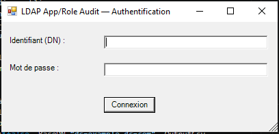
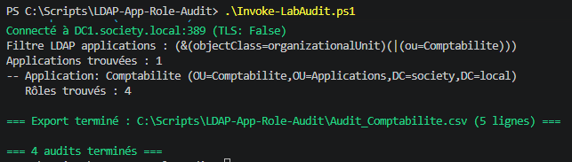

# 🔍 LDAP App/Role Audit


Script PowerShell interrogeant un annuaire LDAP pour produire un export CSV
Application / Rôle / Description — utile pour un audit d'accès applicatifs (IAM/GRC) :
qui a accès à quoi, via quel rôle. Authentification et sélection des applications via
2 popups Windows Forms (`System.Windows.Forms`).

Validé de bout en bout contre un vrai Active Directory sur un lab Windows Server 2022 (voir
"Validation" plus bas) ; un serveur de démo public existe aussi si vous voulez juste l'essayer
sans annuaire à disposition.

Ce script produit la donnée source (qui a accès à quoi) ; la suite logique du pipeline —
détection des conflits de séparation des tâches (SoD), rôles inutilisés, campagnes de
recertification et révocations — est traitée dans
[IAM-Access-Recertification](https://github.com/Anne-LaureS/IAM-Access-Recertification), qui
consomme justement ce format CSV Application/Rôle/Membres.

Ce script audite en lecture seule les comptes/groupes déjà présents dans l'annuaire ; leur
création, mise à jour et désactivation (Joiner/Mover/Leaver) sont traitées côté écriture par
[IAM-JML-Lifecycle](https://github.com/Anne-LaureS/IAM-JML-Lifecycle) — le counterpart "provisioning"
de cet outil d'audit.

## ⚙️ Ce que ça fait

1. **Popup 1** : identifiant (DN) + mot de passe → authentification LDAP (LDAPS par défaut)

   

2. **Popup 2** : un ou plusieurs identifiants d'application à interroger (1 par ligne)
3. Recherche des groupes ("applications") correspondant à ces identifiants
4. Pour chaque application, recherche ses sous-groupes ("rôles")
5. Export CSV trié : nom de l'application, sa description, chacun de ses rôles avec sa
   description et son nombre de membres — une ligne `Role` vide = accès direct à l'application
   elle-même ; `Members` est extrait du DN de chaque membre (ex: `uid=curie,dc=...` → `curie`),
   pas de recherche LDAP supplémentaire par membre

Schéma utilisé par défaut : `groupOfUniqueNames`/`uniqueMember` (RFC 2256, standard OpenLDAP),
pas un schéma propriétaire — `-AppObjectClass`/`-RoleObjectClass`/`-MemberAttribute`/
`-AppNameAttribute` permettent d'adapter aux classes et attributs réels de votre annuaire (voir
Active Directory ci-dessous pour un exemple concret).

## ▶️ Utilisation

```powershell
.\Get-LdapAppRoleAudit.ps1 -LdapServer "votre-ldap.exemple.com" -BaseDN "ou=Applications,dc=exemple,dc=com"
```

Les 2 popups s'ouvrent ensuite pour l'authentification et la sélection des applications.

## 🧪 Validation : lab Active Directory (Windows Server 2022)

Scénario principal de test de ce script — un vrai contrôleur de domaine (VM Windows Server 2022,
`DC1`, domaine `society.local`, réseau isolé host-only/NAT, pas d'exposition externe), Le lab
initial comptait 8 applications et 21 utilisateurs de test, avec des comptes cumulant plusieurs
rôles/applications pour vérifier la détection des recoupements d'accès — le genre de
sur-privilège qu'un audit IAM doit faire remonter. Il a ensuite été **enrichi** (20 applications,
plus de 90 personnes, comptes admin/service/dormants, groupes imbriqués) : voir
[IAM-JML-Lifecycle](https://github.com/Anne-LaureS/IAM-JML-Lifecycle).

AD utilise un schéma différent de `groupOfUniqueNames` : les groupes de sécurité portent leurs
membres dans `member` (pas `uniqueMember`), et une OU n'a pas d'attribut `cn` (son nom est dans
`ou`). Deux façons de modéliser une "application", selon comment elle est structurée dans votre
AD :

**Application = un groupe, avec des membres directs (pas de rôle) :**
```powershell
.\Get-LdapAppRoleAudit.ps1 -LdapServer "DC1.society.local" -BaseDN "OU=Applications,DC=society,DC=local" `
    -AppObjectClass "group" -RoleObjectClass "group" -MemberAttribute "member"
```

**Application = une OU contenant des groupes-rôles** (un groupe ne peut pas avoir d'objets
enfants dans AD, seule une OU le peut — donc ce schéma s'impose dès qu'une application a des
sous-rôles à interroger) :
```powershell
.\Get-LdapAppRoleAudit.ps1 -LdapServer "DC1.society.local" -BaseDN "OU=Applications,DC=society,DC=local" `
    -AppObjectClass "organizationalUnit" -AppNameAttribute "ou" -RoleObjectClass "group" -MemberAttribute "member"
```

Ce DC de lab n'ayant pas de certificat LDAPS configuré, le test réel a été fait avec
`-Port 389 -UseTls:$false` — acceptable ici (réseau isolé, comptes de test jetables), mais à ne
jamais faire contre un annuaire de production (voir Sécurité ci-dessous).

Commande complète reprise dans [`Test-Lab.ps1`](Test-Lab.ps1) :
```powershell
.\Test-Lab.ps1
```

équivalent à :
```powershell
.\Get-LdapAppRoleAudit.ps1 -LdapServer "DC1.society.local" -Port 389 -UseTls:$false -BaseDN "OU=Applications,DC=society,DC=local" -AppObjectClass "organizationalUnit" -AppNameAttribute "ou" -RoleObjectClass "group" -MemberAttribute "member" -OutputCsv "LDAP_Applications_Roles_Audit.csv"
```

| Popup | Champ | Valeur |
|---|---|---|
| 1 — Login | Identifiant | `SOCIETY\Administrateur` |
| 2 — Applications | (une par ligne) | `CRM`, `ERP`, `SIRH`, `Comptabilite`, `RH`, `Juridique`, `Marketing`, `Support-N3` (lab initial), puis `CoreBanking`, `Credit`, `KYC-LCBFT`, `Paiements-SEPA`, `Tresorerie-Marches`, `Risques`, `Monetique`, `Achats`, `ITSM`, `SecOps`, `DevOps`, `Helpdesk` (lab enrichi) |

### Résultats réels

Les 20 applications du lab sont modélisées en OU avec groupes-rôles (la commande
`-AppObjectClass "group"` ci-dessus reste utile pour un AD où une application n'a pas de
sous-rôles, mais ce n'est plus le cas dans ce lab).

Voir détail : [`Audit_Applications_OU.csv`](Audit_Applications_OU.csv) — 81 lignes (20 applications),
même commande que `Test-Lab.ps1` ci-dessus avec `-OutputCsv "Audit_Applications_OU.csv"`.

### Accès indirects : `-ResolveNested`

Dans un annuaire d'entreprise, un accès passe souvent par un groupe imbriqué : la personne est dans
un profil (`G-ROLE-CREDIT-ADMIN`), et le profil est membre du rôle (`Credit-Admin`). Par défaut, le
script ne lit que les membres **directs** d'un rôle : le groupe apparaît alors sous son nom, et la
personne derrière reste invisible pour tout outil d'analyse en aval.

Avec `-ResolveNested` (Active Directory uniquement), le script interroge le contrôleur de domaine
avec la règle de correspondance `LDAP_MATCHING_RULE_IN_CHAIN` et liste les **personnes** qui ont
réellement l'accès, en direct ou par imbrication :

```powershell
.\Get-LdapAppRoleAudit.ps1 -LdapServer "DC1.society.local" -Port 389 -UseTls:$false -BaseDN "OU=Applications,DC=society,DC=local" -AppObjectClass "organizationalUnit" -AppNameAttribute "ou" -RoleObjectClass "group" -MemberAttribute "member" -ResolveNested -OutputCsv "Audit_Applications_OU_ResolveNested.csv"
```

| Rôle | Sans `-ResolveNested` | Avec `-ResolveNested` |
|---|---|---|
| `Credit/Credit-Admin` | `G-ROLE-CREDIT-ADMIN` | `Sophie Nguyen (adm-snguyen)` |
| `CoreBanking/CoreBanking-Admin` | 4 membres, dont `G-ROLE-COREBANKING-ADMIN` | 5 membres : les personnes, dont `Cecile Durand`, ajoutée par erreur à ce profil |

Le commutateur est désactivé par défaut : sans lui, le comportement est strictement inchangé.
Résultat : [`Audit_Applications_OU_ResolveNested.csv`](Audit_Applications_OU_ResolveNested.csv), qui
alimente [IAM-Access-Recertification](https://github.com/Anne-LaureS/IAM-Access-Recertification).

Le script sert aussi à un audit ciblé sur une seule application (ex: un app owner qui veut
juste la revue de la sienne, pas tout l'annuaire) — même commande, `-OutputCsv` différent et un
seul nom saisi au popup 2 :

```powershell
.\Get-LdapAppRoleAudit.ps1 -LdapServer "DC1.society.local" -Port 389 -UseTls:$false -BaseDN "OU=Applications,DC=society,DC=local" -AppObjectClass "organizationalUnit" -AppNameAttribute "ou" -RoleObjectClass "group" -MemberAttribute "member" -OutputCsv "Audit_CRM.csv"
```
Popup applications : `CRM` → [`Audit_CRM.csv`](Audit_CRM.csv)

```powershell
.\Get-LdapAppRoleAudit.ps1 -LdapServer "DC1.society.local" -Port 389 -UseTls:$false -BaseDN "OU=Applications,DC=society,DC=local" -AppObjectClass "organizationalUnit" -AppNameAttribute "ou" -RoleObjectClass "group" -MemberAttribute "member" -OutputCsv "Audit_Comptabilite.csv"
```
Popup applications : `Comptabilite` → [`Audit_Comptabilite.csv`](Audit_Comptabilite.csv)

`lrousseau` cumule 3 rôles admin/lecture sur 2 applications distinctes (CRM + SIRH), `jdupont`
cumule Comptabilite-Admin et ERP-Utilisateur, `hlemoine` cumule Comptabilite-Standard et
ERP-Admin — exactement le type de recoupement qu'un audit d'accès applicatif doit détecter.

### Mode non interactif : `-Credential` et `-AppIds`

Les deux popups ne sont pas adaptées à un audit répété ou planifié. Avec `-Credential` (identifiants
du bind) et `-AppIds` (liste des applications), le script n'affiche plus aucune fenêtre ; chaque
paramètre peut aussi être fourni seul pour ne supprimer que la popup correspondante :

```powershell
.\Get-LdapAppRoleAudit.ps1 -LdapServer "DC1.society.local" -Port 389 -UseTls:$false -BaseDN "OU=Applications,DC=society,DC=local" -AppObjectClass "organizationalUnit" -AppNameAttribute "ou" -RoleObjectClass "group" -MemberAttribute "member" -Credential (Get-Credential) -AppIds "CRM","Credit" -OutputCsv "Audit_exemple.csv"
```

[`Invoke-LabAudit.ps1`](Invoke-LabAudit.ps1) enchaîne ainsi les 4 audits du lab (20 applications en
membres directs, 20 applications avec `-ResolveNested`, puis les audits ciblés CRM et Comptabilite)
en ne demandant les identifiants **qu'une seule fois** :

```powershell
.\Invoke-LabAudit.ps1
```



## 🌐 Démo rapide sur un LDAP public

Pas d'AD/LDAP sous la main ? Le script fonctionne aussi contre le serveur de démo public
[forumsys](https://www.forumsys.com/tutorials/integration-how-to/ldap/online-ldap-test-server/)
(lecture seule) :

```powershell
.\Test-ForumsysDemo.ps1
```

équivalent à :
```powershell
.\Get-LdapAppRoleAudit.ps1 -LdapServer "ldap.forumsys.com" -Port 389 -UseTls:$false -BaseDN "dc=example,dc=com" -OutputCsv "LDAP-App-Role-Audit-ForumSys.csv"
```

| Popup | Champ | Valeur |
|---|---|---|
| 1 — Login | Identifiant (DN) | `cn=read-only-admin,dc=example,dc=com` |
| 1 — Login | Mot de passe | `password` |
| 2 — Applications | (une par ligne) | `scientists`, `mathematicians`, `chemists` |

Export obtenu : [`LDAP-App-Role-Audit-ForumSys.csv`](LDAP-App-Role-Audit-ForumSys.csv).

## 🔐 Sécurité

- **LDAPS par défaut** (`-UseTls`, activé par défaut) — un bind simple non chiffré transmet
  l'identifiant et le mot de passe en clair sur le réseau, interceptable par quiconque peut
  observer le trafic. `-UseTls:$false` n'existe que pour tester contre le serveur de démo public
  ci-dessus (son certificat LDAPS est invalide) — ne jamais désactiver TLS contre un annuaire de
  production.
- **Mot de passe saisi via un champ masqué** (`UseSystemPasswordChar`), jamais en argument de
  ligne de commande en clair.

## ⚠️ Précautions si vous adaptez ce script

- **Listes d'attributs LDAP à retourner** : typer le tableau explicitement
  (`[string[]]$attrs = @("cn", "description")`) avant de l'utiliser comme paramètre `params
  string[]` d'un constructeur .NET (ex: `SearchRequest`). Un littéral `@(...)` passé
  directement en argument peut être silencieusement ignoré selon la plateforme — le filtre
  s'exécute sans erreur, mais aucun attribut n'est retourné.
- **Valeurs d'attributs multi-valeurs comme `uniqueMember`** : `System.DirectoryServices.Protocols`
  peut les renvoyer en `byte[]` plutôt qu'en texte selon le serveur/schéma. Si le paramètre
  d'une fonction est typé `[string[]]`, PowerShell convertit alors chaque `byte[]` en sa
  représentation décimale espacée (des chiffres) au lieu du texte attendu — sans erreur, juste
  un résultat silencieusement faux. Décoder explicitement en UTF-8 quand `$_ -is [byte[]]`
  (voir `Get-MemberNames` dans le script).
